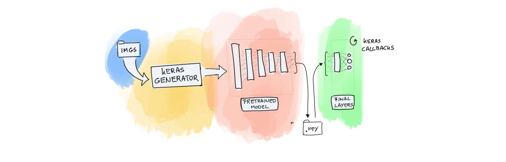

# Wallholla



> a playground for deep learning experiments

## Usage

Here's an example: 

```
python command.py run-grid --dataset=catdog --model=vgg16
```

#### FloydHub 

If you want to run this on floydhub.

```
floyd run --cpu2 --env tensorflow-1.8 --data cantdutchthis/datasets/dataz/1:/datasets "python command.py run-grid --dataset=catdog --model=vgg16"
```

You can retreive data from the job via; 

```
floyd data clone cantdutchthis/projects/walholla/47/output
floyd data clone cantdutchthis/projects/walholla/48/output
floyd data clone cantdutchthis/projects/walholla/49/output
floyd data clone cantdutchthis/projects/walholla/51/output
floyd data clone cantdutchthis/projects/walholla/52/output
floyd data clone cantdutchthis/projects/walholla/54/output
floyd data clone cantdutchthis/projects/walholla/55/output
mv *.csv output
```

#### AWS Sagemaker 

First make sure all the images are on S3. 

```
aws s3 sync /datasets s3://walholla-imgs
```

AWS expects to run the following command in sagemaker with one of your containers.

```
docker run  train
```

So we've got a stupidly simple container set up to run this.

## Getting the container to AWS

Type in the following:

```
aws ecr get-login --no-include-email --region eu-west-1
```

This gives you a giant blob of a URL. Copy it and run it. Now yer logged in. Next;

```
docker build -t walholla .
docker tag <repo_link>
docker push <repo_link>
```

For me this was;

```
docker build -t sgmkrs .
docker tag walholla-repo:latest 829902169525.dkr.ecr.eu-west-1.amazonaws.com/walholla-repo:latest
docker push 829902169525.dkr.ecr.eu-west-1.amazonaws.com/walholla-repo:latest
```

Now that this has been pushed, sagemaker can run it. The `sagemaker.py` script contains all you'll need.  

## File Structure

```
pretrained
 +- catdog
     +- vgg16
         +- validation
         +- train-200-1000-random
         +- train-200-1000-very-random
     +- mobilenet
         +- validation
         +- train-200-1000-random
         +- train-200-1000-very-random
 +- mnist
     +- vgg16
         +- validation
         +- train-200-1000-random
         +- train-200-1000-very-random
     +- mobilenet
         +- validation
         +- train-200-1000-random
         +- train-200-1000-very-random
 +- ...
```

## Test 

We're experimenting with the `marbles` library for our tests. You can run a test via;

```
python -m marbles tests/utils-tests.py
```

## Why the name

Wallholla is a very large and [renown](https://www.dutchdesignawards.nl/en/gallery/habitat/the-wall-holla/) playground for children. We now have one for children in the Netherlands, we now also have one for children in the deep learning community.
